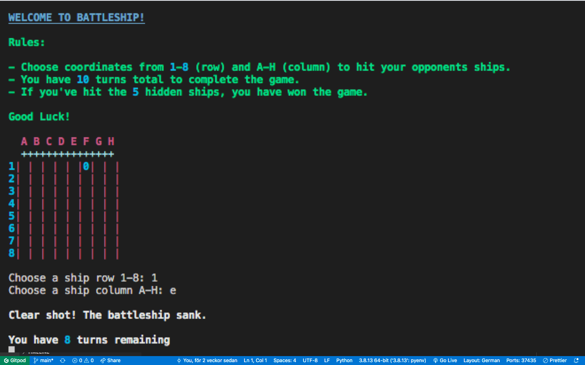

# Battleship Terminal Game

Battlehship is a strategy type guessing game where the player will be playing against the computer and will be able to pick a Column and a Row.

Here is a demo on the Battlehship game: 
https://battleshipproject3.herokuapp.com/

Link to my repository:
https://github.com/MalleNur/Battleship-pp3

# Features

# How The Game Works + Battleship Flowchart

- This game shows a guessing board with a column from A-H and a row from 1-8.
- There will be information about rules and how the game works. 
- The player will be asked to guess a row and a column 10 times. If the player hits the 5 hidden ships the player wins the game. 
- Otherwise the player gets a message that they didnt hit right amount of hidden ships and will be asked if they want to start over and play the game again.

Here is a chart overview of the Battleship Game, called flowchart. 
Its a description of how the game function from start to finish. 

# Testing/Debugging

- I had alot of errors with whitespace and lines being too long when i wrote my code. By putting my code through PEP8 validator i was able to find all the errors.
- I had to fix couple of indentation that is crucial to fix/debugg. 

# Validator Testing

PEP8

- No errors were returned from PEP8online.com

# Deployment

## Local Deployment

Gitpod IDE was used to write the code for this project.

To make a local copy of this repository, you can clone the project by typing the follow into your IDE terminal:

https://github.com/MalleNur/Battleship--PP3.git

## Heroku
To deploy this project run
https://battleshipproject3.herokuapp.com/

Deployment steps are as follows, after you have an account setup:

- Select New in the top-right corner of your Heroku Dashboard, and select Create new app from the dropdown menu.
- Your app name must be unique, and then choose a region closest to you (EU or USA), and finally, select Create App.
- From the new app Settings, click Reveal Config Vars, and set the value of KEY to PORT, and the value to 8000 then select add.
- Further down, to support dependencies, select Add Buildpack.
- The order of the buildpacks is important, select Python first, then Node.js second. (if they are not in this order, you can drag them to rearrange them)

Heroku needs two additional files in order to deploy properly.

- requirements.txt
- Procfile
You can install this project's requirements (where applicable) using: pip3 install -r requirements.txt. If you have your own packages that have been installed, then the requirements file needs updated using: pip3 freeze --local > requirements.txt

The Procfile can be created with the following command: echo web: node index.js > Procfile

For Heroku deployment, due to recent security issues, users can no longer deploy via the Heroku Dashboard. Follow these steps to connect your GitHub repository to the newly created app:

- In the Terminal/CLI, connect to Heroku using this command: heroku login -i
- Set the remote for Heroku: heroku git:remote -a <app_name> (replace app_name with your app, without the angle-brackets)
- After performing the standard Git add, commit, and push to GitHub, you can now type: git push heroku main

The frontend terminal should now be connected and deployed to Heroku.
# Tech Stack

## Primary Language
- Python 

## Code repository/ Version control etc.
- Gitpod - Used for development as the cloud-based IDE
- Github - Used for securing my code online
- Git - VC (git add, git commit, git push etc.)

## Python Standard Libary Modules
- Random - Used randint for generating random coordinates
- Time - Used sleep for suspending execution of next thread to enhance user experience

## External Libraries
- Rich - Rich is a Python library for rich text and beautiful formatting in the terminal. In this project it was used to add colour and panels to surround the pyfiglet game messages.

## Deployment
- Heroku - Used to display the terminal view of this backend application in a modern web browser.

# Acknowledgements

 - External references is not included in the code comments but i have had  inspiration from couple of tutorials in Youtube combined with Code Institute tutorials.
 References from Youtube
 - https://www.youtube.com/watch?v=_uQrJ0TkZlc
 - https://www.youtube.com/watch?v=Gi0Fdyhk1_0
 - https://www.youtube.com/watch?v=u3yo-TjeIDg

# Authors

- [@MalleNur](https://github.com/MalleNur)

# 🚀 About Me
I'm a full stack developer...

Studying at Code Institute at the moment.
